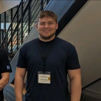

## Welcome to Dakota Riley's GitHub Portfolio page!
* [Intro](#i-am-a-security-engineer-consultant-and-leader-with-skills-in-cloud-security-application-security-detection-engineering-and-automation)
* [Speaking](#speaking)
* [Blogs](#blogs)
* [Contributions](#contributions)
* [Other Fun Stuff](#Other)

### I am a Security Engineer, Consultant, and Leader with skills in Cloud Security, Application Security, Detection Engineering, and Automation. 

 

I have worked at startups, large enterprises, FAANG, and the Federal Government helping customers solve security engineering challenges, as both a consultant, and owner. I enjoy getting to solve large scale challenges with both code and strategy, and enabling engineering teams to move fast without having to worry about security. I deeply care about making the right thing as easy as possible, and the end user experience of security.

I prefer environments that reward creative thinking, strong ownership of problems, and data driven decision making. 

While I enjoy going deep on technical problems, I love being able to step back and solve problems at the source vs bandaid fixes.

## Speaking

**CloudNativeSecurityCon 2024: Detection Engineering in Kubernetes Environments**

:chart_with_upwards_trend: [Slides](https://github.com/rileydakota/cncs-2024-k8s-det-eng-talk/blob/main/cncs-slides.pdf)

**AWS Community Day Midwest: Exploring Amazon Lake**

:video_camera: [YouTube](https://www.youtube.com/watch?v=Kzwt6AdCBrM) \
:chart_with_upwards_trend: [Slides](https://github.com/rileydakota/seclake-exploration/blob/main/AWS%20Community%20Day%20Midwest%20-%20SecLake.pdf) \
:notebook: [Jupyter Notebook](https://github.com/rileydakota/seclake-exploration/blob/main/seclake_cloudtrail_investigation.ipynb)

**SANS CloudSecNext 2023: Detective Controls in Kubernetes Environments**

:video_camera: [Youtube](https://www.youtube.com/watch?v=Old-6aKmzrg)

**The Security Engineers Guide To Infrastructure-As-Code**

:chart_with_upwards_trend: [Slides](https://github.com/rileydakota/nku-cyber-2021-iac-security/blob/main/ppt/iac_security_ppt.pdf)

# Blogs
**[Exploring the GitHub Advisory Database for fun and (no) profit](https://blog.aquia.us/blog/2024-02-27-gh-advisory-db/)** 

In this blog, I downloaded the entire GitHub Advisory Database, and loaded it into Pandas to look for trends across Open Source Vulnerabilities.

**[Tactical Cloud Audit Log Analysis with DuckDB - AWS CloudTrail](https://dev.to/aws-builders/tactical-cloud-audit-log-analysis-with-duckdb-aws-cloudtrail-2amk)** \

In this blog, I cover how to load, parse, and interact with AWS CloudTrail logs utilizing DuckDB, a tool that allows you to locally query and interact with larger than memory datasets that still fit on a single device. Its a great tool for needing to query when you don't have a SIEM available, and is faster than Athena with certain data sizes.

**[Taking the Secrets Manager Lambda Extension for a spin](https://blog.aquia.us/blog/2023-01-01-secrets-manager-lambda-extension)** 

This blog, I use the AWS Secrets Manager Lambda extension in different Lambda functions, and benchmark how it impacts performance compared to other methods. 

**[Threat Detection on EKS - Comparing Falco and GuardDuty for EKS Protection](https://blog.aquia.us/blog/2022-05-06-guardduty-falco/)** 

I partnered with co-worker and friend Dustin Whited [@dgwhited] to compare Falco and EKS GuardDuty as options for threat detection in EKS environments. 

**[Using Semgrep to find security issues and misconfigurations in AWS Cloud Development Kit projects](https://blog.aquia.us/blog/2022-02-18-semgrep-cdk/)** \

In this blog, I combined my love of static code analysis and infrastructure-as-code to find problems in CDK projects in the actual CDK code itself. 

# Contributions and OSS

**[Stratus Red Team](https://github.com/DataDog/stratus-red-team/pull/160/commits/59bd6e4211dca2a82107a8b64c169bd27caf6921)** - added GCP Support and Initial GCP Technique

**[Peirates](https://github.com/inguardians/peirates/pull/55)** - added support for detecting AWS as a Cloud Provider when IMDSv2 is in use

**[Semgrep](https://github.com/semgrep/semgrep-rules/pull/1629)** - added rules for the static analysis of AWS Cloud Development Kit (CDK) projects

**[Panther-Analysis](https://github.com/panther-labs/panther-analysis)** - added new detection rules for [CodeBuild Public Projects on AWS](https://github.com/panther-labs/panther-analysis/pull/302)

**[Matano](https://github.com/matanolabs/matano/pull/162)** - added a managed enrichment table for the Cybersecurity and Infrastructure Agency Known Exploited Vulnerabilities (AKA CISA KEV), allowing 

CfnSweeper - A CLI tool I built for finding AWS resources unmanaged by AWS Cloudformation, built to help engineers clean up AWS resources often left behind from CDK constructs that have removalPolicies that retain the resource by default. 

<!--
**rileydakota/rileydakota** is a ✨ _special_ ✨ repository because its `README.md` (this file) appears on your GitHub profile.

Here are some ideas to get you started:

- 🔭 I’m currently working on ...
- 🌱 I’m currently learning ...
- 👯 I’m looking to collaborate on ...
- 🤔 I’m looking for help with ...
- 💬 Ask me about ...
- 📫 How to reach me: ...
- 😄 Pronouns: ...
- ⚡ Fun fact: ...
-->

